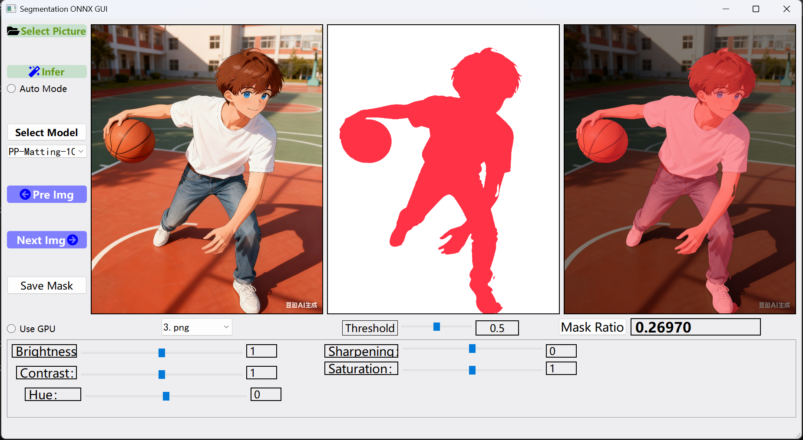
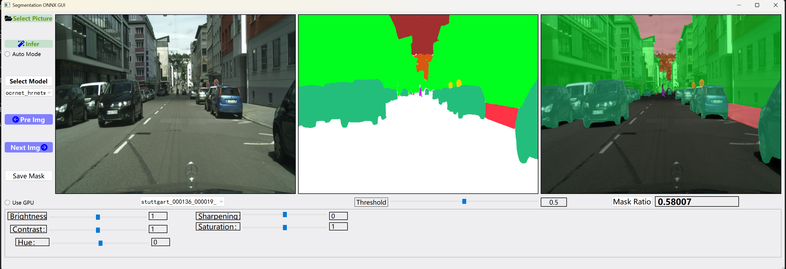

# Semantic Segmentation ONNX Inference GUI

A lightweight and user-friendly GUI tool for performing **semantic segmentation** inference using **ONNX models**.  
This application supports models exported from **[PaddleSeg](https://github.com/PaddlePaddle/PaddleSeg)** as well as models from other deep learning frameworks that are compatible with the ONNX format.

---

## ✨ Features

- 🧠 **ONNX model inference** powered by [ONNX Runtime](https://onnxruntime.ai/)  
- 🖼️ **Interactive GUI** built with [PyQt5](https://pypi.org/project/PyQt5/)  
- ⚙️ **Model-agnostic**: Works with PaddleSeg-exported models and standard ONNX segmentation models  
- 🎨 **Image enhancement controls**:
  - Brightness, contrast, hue, sharpness, and saturation adjustment  
- 🧩 **Flexible preprocessing**:
  - Automatic input shape detection  
  - Dynamic dtype handling (`float32`, `float16`, etc.)  
- 🔍 **Overlay visualization**:
  - Segmentation mask overlay on original image  
  - Adjustable transparency and color mapping  

---


## 🖥️ Demo

case1: (Model: ./models/PP-Matting-1024.onnx) (Img: ./images/3.png)




case2: (Model: ./models/ocrnet_hrnetw18_cityscapes.onnx) (Img: ./images/stuttgart_000136_000019_leftImg8bit.png)



---


## 📦 Installation

### 1. Clone the repository
```bash
git https://github.com/chenzhaoqiJM/segmentation-onnx-gui.git
cd segmentation-onnx-gui
```

### 2. Create a Python environment (recommended)

```bash
conda create -n onnx_infer python=3.12
conda activate onnx_infer
```

### 3. Install dependencies

```bash
pip install -r requirements312.txt
```

Please select the requirements file according to your python version

---


## 🚀 Usage

### 1. Launch the GUI

```bash
python main.py
```

### 2. Load your ONNX model

* Click **“Select Model”**
* Select your `.onnx` file (e.g., PaddleSeg exported model)

### 3. Open an image

* Click **“Select Picture”** to choose an input image
* Adjust image enhancements if needed

### 4. Run inference

* Click **“Infer”** to generate segmentation results
* Adjust overlay opacity to compare the result with the original image

---


## 🧩 Model Requirements

* **Input format**: `NCHW` (e.g., `[1, 3, 1024, 1024]`)
* **Data type**: `float32` or `float16`
* **Output**: segmentation logits mask (Not through softmax)

If your model input type differs, the tool automatically adapts preprocessing based on the model’s `input_type`.


This GUI supports **semantic segmentation models** exported to ONNX format with the following output conventions:


### **1. Multi-class segmentation output**

**Shape:**

```
[1, C, H, W]
```

**Description:**

* `C` > 1 means the model predicts **multiple semantic classes** (including background).
* Each channel represents the logits for one class.
* The code automatically applies **softmax** along the channel dimension to normalize scores into probabilities.

**Processing steps:**

```python
logmax = softmax(output_index_0)  # Apply softmax over channels
pred2 = logmax[0, 1:, :, :]       # Drop background channel (index 0)
```

**Notes:**

* The first channel (index 0) is treated as **background** and is excluded from visualization.
* Works for standard semantic segmentation models such as:

  * PaddleSeg models (`DeepLabV3+`, `UNet`, `SegFormer`, etc.)
  * ONNX models exported from PyTorch / TensorFlow with per-class logits.


### **2. Binary segmentation output (single channel)**

**Shape:**

```
[1, 1, H, W]
```

**Description:**

* The model produces a single-channel output for binary masks (foreground vs background).

**Processing logic:**

```python
if output.min() >= 0 and output.max() <= 1:
    # Binary output is already a probability map
    pred2 = output[0]
else:
    # Binary output is a logit map, apply sigmoid
    pred2 = sigmoid(output)[0]
```

**Notes:**

* Automatically detects whether the model output is already in [0,1] range.
* Applies **sigmoid** only when the raw output appears to be logits.


### **3. Error Handling / Fallback**

If inference fails for any reason (invalid shape, type mismatch, etc.),
the code safely returns a **dummy mask** of shape `(1024, 1024)` filled with ones:

```python
pred2 = np.ones(shape=(1024, 1024), dtype=np.float32)
```

This prevents GUI crashes during debugging or invalid model loading.


### Summary Table

| Output Type                       | Expected Shape        | Activation Applied | Description                            |
| --------------------------------- | --------------------- | ------------------ | -------------------------------------- |
| Multi-class segmentation (logits)         | `[1, C, H, W]`, C > 1 | Softmax            | Standard segmentation logits per class |
| Binary segmentation (logits)      | `[1, 1, H, W]`        | Sigmoid            | Converts logits to probability map     |
| Binary segmentation (probability) | `[1, 1, H, W]`        | None               | Already normalized mask                |
| Invalid / Error                   | Any                   | None               | Returns dummy mask of ones             |


### Input Compatibility 

The model input is also automatically adapted:

* Supports `tensor(float)` and `tensor(float16)`
* Supports 3-channel RGB or single-channel grayscale input
* Automatically resizes input to match model’s `H × W`


---


## 📁 Project Structure

```
.
├── main.py                # Main program entry (GUI main window)
├── ui_files/              # UI-related resources (icons, .ui files, etc.)
├── models/                # Default ONNX models (optional)
├── images/                # Example images
├── assets/                # Resource files (sample images or color maps)
├── cmythread.py           # Preprocessing, inference, and postprocessing code
├── sub.py                 # GUI interaction logic
└── requirementsxxx.txt    # Requirement files for different Python versions
```

---


## ⚙️ Secondary Development

If you want to customize or extend the interface and functionality, follow these steps:

1. **Edit the UI File**
    Open and edit the interface file with **Qt Designer**:

   ```
   ui_files/auto.ui
   ```

   Save the file after making your changes.

2. **Convert `.ui` to `.py`**
    Run the following command to convert the updated `.ui` file into a Python module:

   ```bash
   python -m PyQt5.uic.pyuic ui_files/auto.ui -o ui_files/auto.py
   ```

3. **Run the Application**
    Execute the command below to launch the application and check the updated interface:

   ```bash
   python main.py
   ```

4. **Customize Model Logic**

   - To modify **pre-processing** and **post-processing** logic, edit:

     ```
     cmythread.py
     ```

   - To adjust **UI interaction** and **model initialization** logic, edit:

     ```
     sub.py
     ```

---


## ⚙️ Advanced Notes

* Supports **float16** inference when ONNX model expects it
* Automatically handles **channel normalization** and **resizing**
* Compatible with **ONNX models exported from PyTorch**, **TensorFlow**, and **PaddlePaddle**

---


## 🧠 Example: Exporting from PaddleSeg

```bash
python tools/export.py \
--config configs\ocrnet\ocrnet_hrnetw18_cityscapes_1024x512_160k.yml \
--model_path model.pdparams \
--input_shape 1 3 512 1024 \
--output_op none
```


```
paddle2onnx --model_dir output/inference_model \
--model_filename model.pdmodel \
--params_filename model.pdiparams \
--opset_version 11 \
--save_file ocrnet_hrnetw18_cityscapes.onnx
```

---


## 📜 License

This project is released under the **MIT License**.
See [LICENSE](LICENSE) for details.

---


## 🤝 Contributing

Contributions, issues, and feature requests are welcome!
Feel free to open a pull request or report a bug.

---


## 📬 Contact

Author: chenzhaoqi
Email: 869948402@qq.com

---

